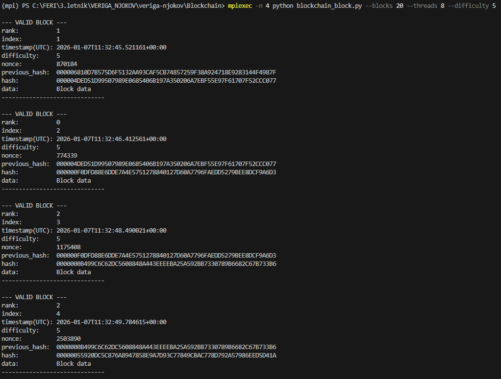
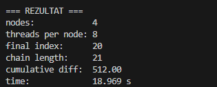
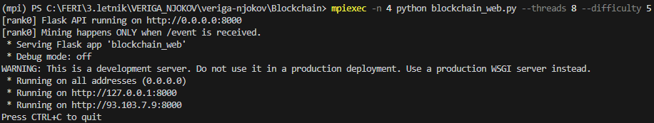
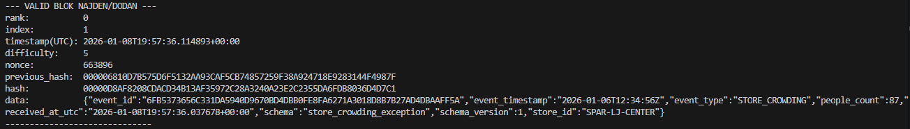
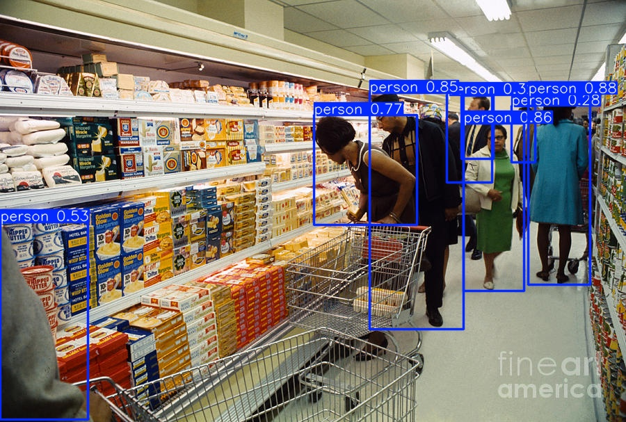
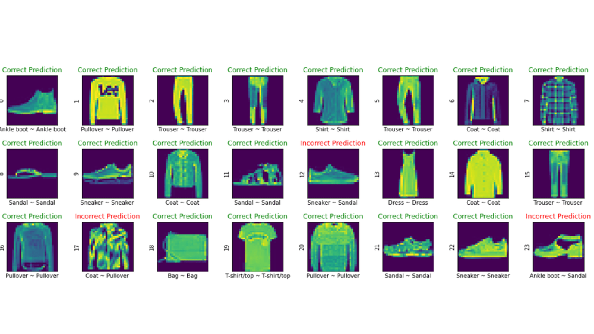

# Veriga Njokov

A multi-module digital twin project for fashion retail monitoring, combining mobile sensing, geospatial visualization, distributed computing, and computer vision.

## Overview

Veriga Njokov is a cross-domain software project that models operational conditions in fashion stores across a city.  
It brings together:

- an Android client for event and sensor data collection,
- a map-based visualization layer for store and user status,
- an MPI-based blockchain mining prototype for distributed event handling experiments,
- and computer vision prototypes for people counting and clothing-type recognition.

The repository demonstrates practical integration of mobile, web, data, and ML/distributed components in one system.

## Implemented Features

### 1) Android data collection app
- Captures sensor-driven and user-triggered events.
- Sends data toward backend/server-side components.
- Includes configurable application settings (notifications, language, theme).

### 2) Interactive 2D map and detail view
- Displays store/user locations on a 2D map.
- Loads data through API calls.
- Supports detailed information panels on location selection.

### 3) MPI-parallel blockchain prototype
- Implements a block mining algorithm with MPI parallelization.
- Supports inter-process block communication.
- Includes integration scripting for exceptional event ingestion.

### 4) Sensor simulation flow
- Simulates in-store people-count style input data.
- Persists generated data at intervals through backend/web components.

### 5) Computer vision prototypes
- People counting on images using YOLOv8n.
- Initial work on clothing-type recognition.

## Project Snapshots

### Android application

### Map visualization

### Settings and simulation UI

### Blockchain + CV outputs

## Technology Stack

Based on repository language composition and implemented modules:

- **Kotlin** (Android/mobile)
- **JavaScript / HTML / CSS** (web/map UI)
- **Python** (MPI prototype scripts, CV/ML)
- **Java** (supporting components)

Language share:
- Kotlin 39.1%
- JavaScript 31.6%
- HTML 11.7%
- Python 8.2%
- Java 7.5%
- CSS 1.9%

## Repository

- **GitHub:** https://github.com/JakaZaka/veriga-njokov
- **Default branch:** `develop`

## Roadmap (Planned Improvements)

- Real-time end-to-end event flow between mobile, backend, and map.
- Time-based store occupancy simulation and prediction views.
- Extended blockchain performance/acceleration analysis across thread/process counts.
- Improved clothing recognition robustness on broader user-captured images.
- Enhanced map rendering performance via local tile caching.
- Event-location selection and richer store data management workflows.

## Team

- Jaka Počkaj
- Anđelija Lazarević
- Nela Copot
